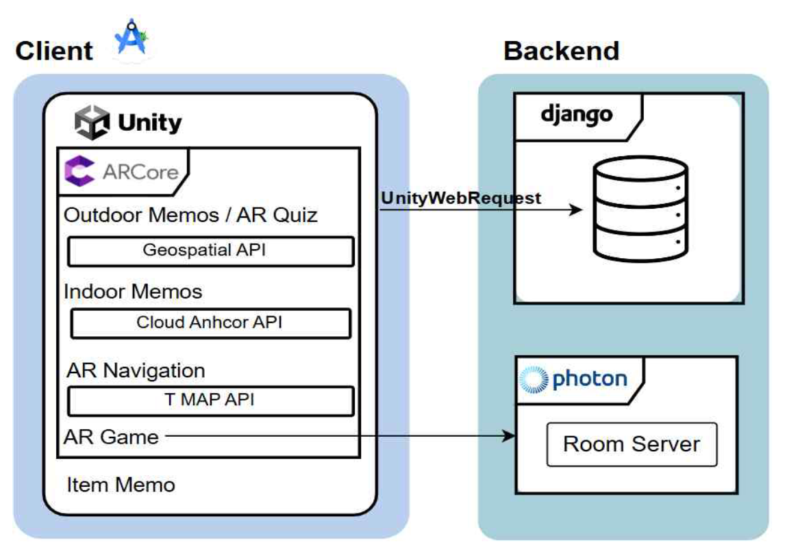
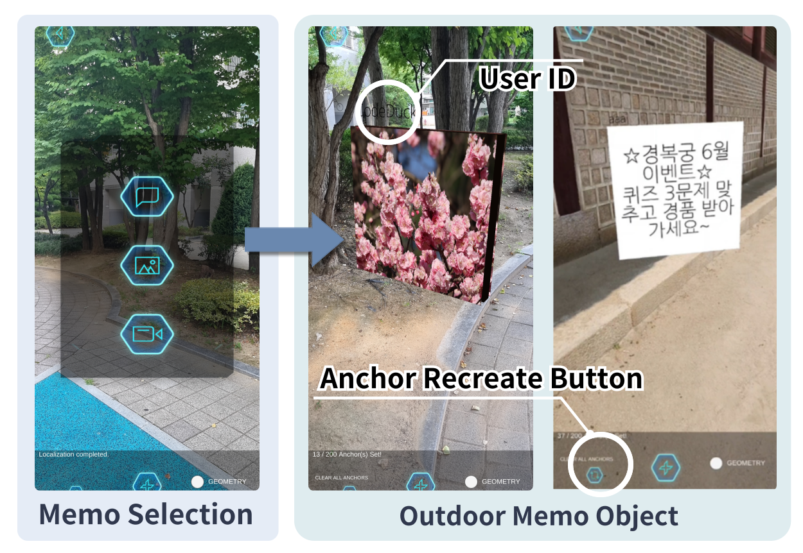
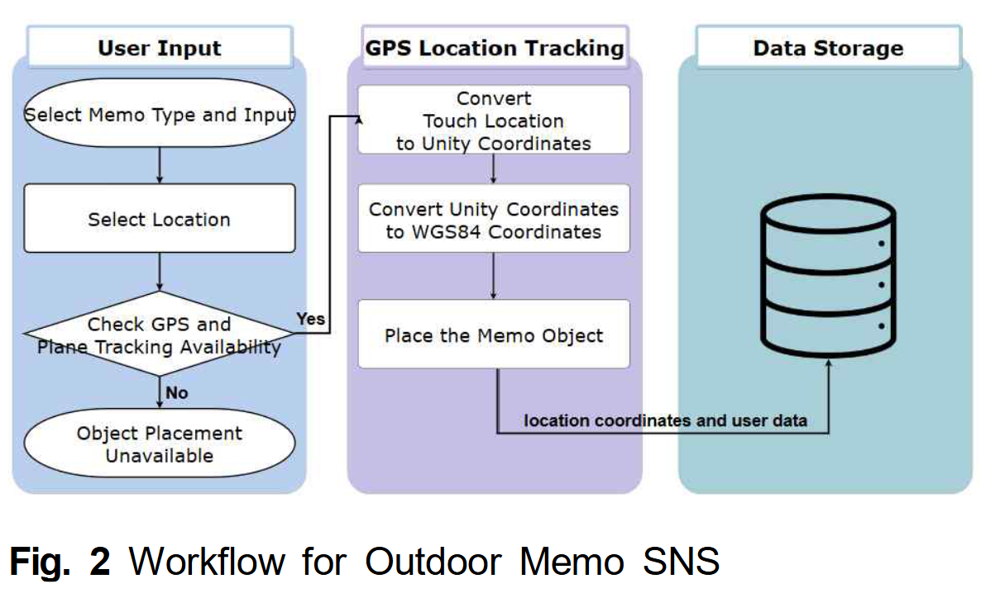
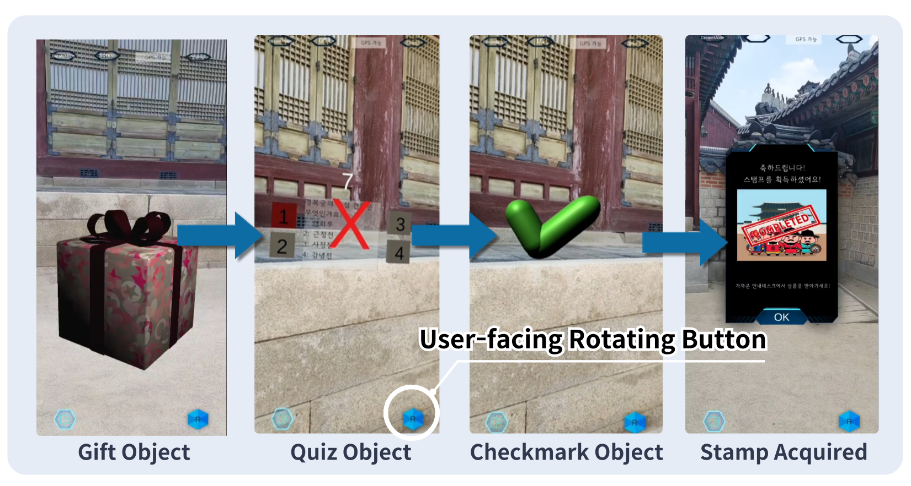
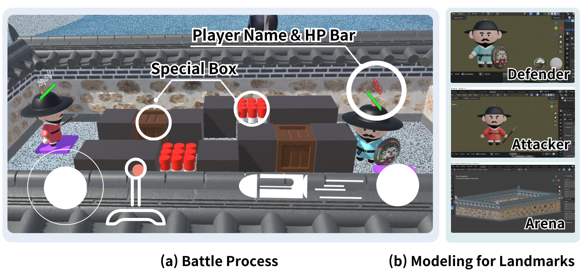
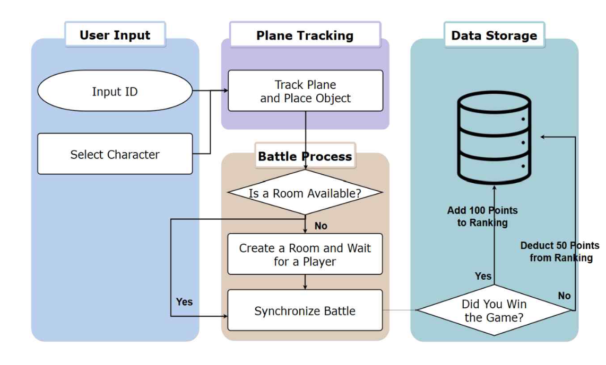

# IMAEZIM

실제 장소에 AR 메모를 남기고 공유하는 위치 기반 SNS 애플리케이션입니다.  
실내외 메모를 중심으로 AR 퀴즈, 길찾기, 2인용 게임을 결합해 사용자가 현실 공간에서 디지털 콘텐츠와 상호작용하도록 설계했습니다.

> **핵심 기능:** GPS 기반 실외 AR 메모, AR 퀴즈, AR 길찾기, Photon 기반 2인용 AR 게임

- **개발 기간:** 2023.10 ~ 2024.09
- **개발 인원:** 5명

## 기술 스택 및 시스템 구조

| 구분 | 기술 |
| --- | --- |
| Client | Unity, Kotlin, Android |
| AR | ARCore, Geospatial API, Plane Tracking, YOLO |
| Multiplayer | Photon |
| Backend | Python, Django 4.2.2, Django REST Framework 3.14.0 |
| Database | SQLite |
| Data / Media | REST API, JSON, Pillow |

### 시스템 아키텍처

  

## 담당 범위

- 팀장 및 프로젝트 일정·의사결정 관리
- GPS 기반 실외 AR 기능
- AR 퀴즈
- Photon 기반 2인용 AR 게임
- Django REST Framework 서버 구축 및 Unity–DRF API 연동
- 전체 아키텍처 문서화 및 논문 작성

## 프로젝트 결과

- 캡스톤디자인 수행평가 최종 1위
- 제2회 캡스톤디자인 경연대회 우수상
- 한국정보통신학회논문지 KCI 게재

## 주요 구현

### 1. GPS 기반 실외 AR 메모

  

- GPS와 Geospatial API를 이용해 실제 위치에 텍스트, 사진, 음성, 영상 AR 메모 배치
- 위도, 경도, 고도와 앵커 회전값을 서버에 저장하고 Unity 좌표계의 AR 오브젝트로 복원
- 실외 메모 API에서 메모 생성, 유형별 콘텐츠 저장, 전체 메모 조회 기능 제공

GPS 실외 다이어그램

  

### 2. AR 퀴즈

  

- 경복궁의 특정 GPS 좌표에 문제와 정답을 가진 3D 퀴즈 오브젝트 배치
- 퀴즈 데이터 조회와 사용자별 정답 기록 API 구현
- 동일 사용자의 중복 정답 기록을 방지하고, 스탬프 획득 여부를 저장할 수 있도록 데이터 모델 구성

### 3. Photon 기반 2인용 AR 게임

  

- ARCore Plane Tracking으로 현실 평면에 2인용 게임 경기장 배치
- Photon Room을 이용해 두 플레이어의 이동·공격·전투 상태를 실시간 동기화
- 게임 종료 시 승리 `+100점`, 패배 `-50점`을 반영하고 상위 10명 랭킹 제공

AR 게임 다이어그램

  

## 팀원 및 역할
 

<table>
  <tr>
    <td align="center">
       
      <b>경다은</b> 
      팀장 · Backend / Unity
    </td>
    <td align="center">
       
      <b>김가윤</b> 
      Unity / Android
    </td>
    <td align="center">
       
      <b>서윤수</b> 
      Unity / Android
    </td>
    <td align="center">
       
      <b>오다은</b> 
      Backend / Unity
    </td>
    <td align="center">
       
      <b>전은채</b> 
      Unity / Android
    </td>
  </tr>
</table>